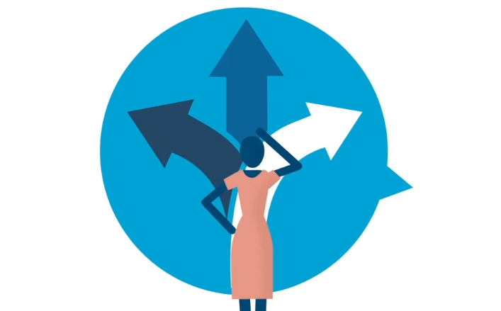
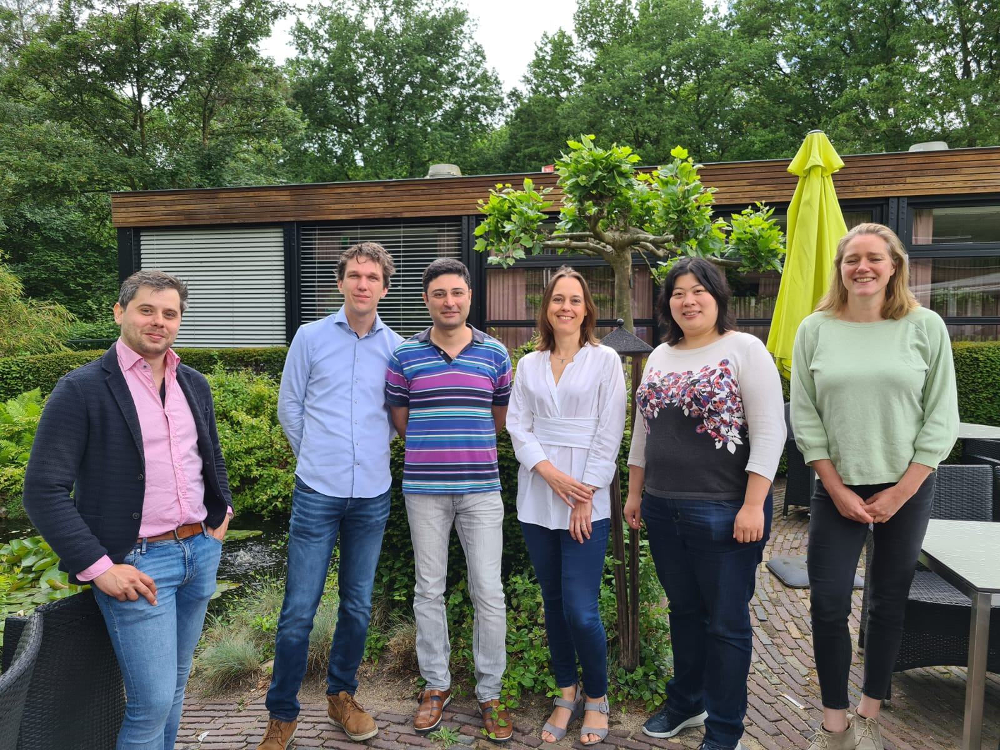

# De Jonge Akademie Funding Consultation 

<!-- a brief introduction to explain what the project is about    -->
*If you could consult all academics in your country, what questions will you ask?*

Science policy decisions have a major impact on academics. However, it is not always clear who makes these decisions, and whether these decisions have really been made after broad consultation with the community—especially of those community members, who are not naturally ‘at the tables’. How can we also include these voices? And in doing this, how can we move from polarized stance-taking to a more nuanced discussion, acknowledging the real dilemmas a policy-maker may face?

With this Funding Consultation project, [De Jonge Akademie](https://dejongeakademie.nl/) wish to experiment with this broad participatory decision making. We have adopted the [participatory value evaluation method](https://www.tudelft.nl/en/tpm/pve), which has been developed by fellow researchers at the TU Delft, and has successfully been applied in large-scale citizen consultations on topics that spark fierce societal debate, such as the lifting of coronavirus measures or installation of wind turbines on land.

In our first case, we will run a consultation on science funding: a topic that affects all academics in The Netherlands. At present, discussions are taking place about possible funding reforms, which trigger strongly polarized responses. If we would address *all* academics in the Netherlands and ask them to weigh their preferences on this matter, what insights can we gain? By choosing this method, we wish to create an evidence-based collective signal that can better inform our policymakers. You can check the [full list of questions and their accompanying descriptions](https://github.com/DeJongeAkademie/FundingConsultation2022/blob/master/material/Question_Descriptions.md).

## How to contribute
We invite all researchers to explore the data collected in this project and/or ask questions that we might be able to investigate based on this consultation. We thrive to share all the analysis code at an early stage. Contributors are invited to describe their reusable syntax in [the FAIR code](./FAIRcode.md)

### via discussions
If you have a question that you want to be investigated based on this data or you are curious about a certain aspect of the consultation, please [use the discussions page](https://github.com/DeJongeAkademie/FundingConsultation2022/discussions). 

### via pull-requests
If you want to analyze the data yourself, your are welcome to fork the repository. We appreciate if you share back your results via sending pull-requests.
Please note that the free-text answer are not shared on this repository. If you are interested in contributing to that part of the data analysis, please contact us via email at dja@knaw.nl.

## Contributors (alphabetic order)

+ Shari Boodts (Radbout University, Nijmegen)
+ Sanli Faez (Utrecht University)
+ Chiel van Heerwaarden (Wageningen University)
+ Lizza Hendriks (Maastricht UMC+)
+ Cynthia Liem (Delft University of Technology)
+ Caspar van Lissa (Tilburg University)
+ Ahmed Mahfouz (Leiden University)
+ Noel de Miranda (Leiden University)
+ Linnet Taylor (Tilburg University)

## Background of the project

<!-- A few words on the history of the project-->
This project has been concieved in October 2021 by five newly elected members of [The Young Academy](https://www.dejongeakademie.nl/en/default.aspx).

The consultation questions has been decided in three workshops and several dicussion sessions between November 2021 and May 2022, with assistance from [Populytics](https://populytics.nl/en/) specialists: Niek Mouter and Shannon Spruit. The project has received further assistance from Maarje Aukes, Tom Geijsen (Populytics), Cas Henckens, Samya Ihattaren, and Esther Ladiges.

You can find here answers to [Frequently Asked Questions](https://dejongeakademie.nl/faq+raadpleging+onderzoeksfinanciering/faq+research+funding+consultation/default.aspx#question=2210946) about this project. If your question is not answered on that page, please create a new issue or send and email to dja@knaw.nl.

 
  
From left: Cas Henckens, Chiel van Heerwaarden, Sanli Faez, Lizza Hendriks, Cynthia Liem, Maartje Aukes.

## In the press

+ [Interview with Sanli Faez](https://www.advalvas.vu.nl/nieuws/jonge-akademie-wil-wetenschappers-laten-meedenken-over-verdeling-onderzoeksgeld), 20 May 2022, Ad Valvas  (in Dutch)
+ Announcement coverage (11 May 2022)
    * [Delta, TU-Delft](https://www.delta.tudelft.nl/article/hoe-zou-jij-900-miljoen-euro-verdelen-vraagt-jonge-akademie#)
    * [VOX Radboud University](https://www.voxweb.nl/kort-nieuws/de-jonge-akademie-evalueert-onderzoeksfinanciering)
    * [u-today, University of Twente](https://www.utoday.nl/news/71419/hoe-zou-jij-900-miljoen-euro-verdelen-vraagt-jonge-akademie)
    * [Mare, Leiden University](https://www.mareonline.nl/nieuws/jonge-akademie-onderzoekt-hoe-zouden-jonge-wetenschappers-het-geld-verdelen/)
    * [DUB, Universiteit Utrecht](https://dub.uu.nl/nl/nieuws/%e2%80%98laat-het-stille-midden-meedenken-over-onderzoeksgeld%e2%80%99)
    * [Resource, Wageningen University and Research](https://www.resource-online.nl/index.php/2022/05/17/raadpleging-jonge-akademie-over-verdeling-onderzoeksgeld/)
    * [NOG, Nationale Onderwijsgids](https://www.nationaleonderwijsgids.nl/universiteit/nieuws/61535-de-jonge-akademie-geeft-wetenschappers-kans-om-mee-te-denken-over-geld.html)
    

## The structure of this repository

<!--  You can add rows to this table, using "|" to separate columns.         -->
SubFolder                    | Description                     | Usage         
----------------------------- | -------------------------------- | --------------
/data | anonymized data gathered from the participants. | to store (filtered) data and descriptions
/material | descriptions of the survey questions | to share the study material and other useful resources
/python | analysis code in python programming language | to share the python scripts and notebooks
/R | analysis code in R programming language | to share the R scripts and notebooks
/results | collection of analysis outcome  | for contributors to share intermediate results and staged reports
/_syntax | code used for cleaning up and converting the online database to csv-files | shared for reproducibility and verification

The consultation also contained free-text entries that has been filled by more than 1000 Dutch academics. 
The answers to those questions will not be shared publicly to respect participants privacy.

<!--  You can consider adding the following to this file:                    -->
<!--  * A citation reference for your project                                -->
<!--  * Contact information for questions/comments                           -->
<!--  * How people can offer to contribute to the project                    -->
<!--  * A contributor code of conduct, https://www.contributor-covenant.org/ -->

